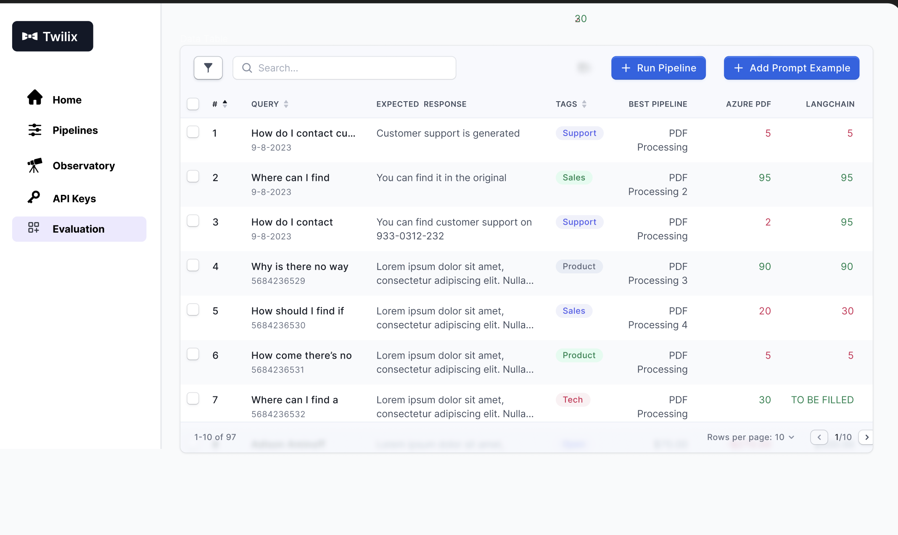

# Evals

Evals provides a Pythonic way to run offline evaluations on your LLM pipelines so you can launch comfortably into production.

You can get started with adding an a ground truth like so:

# QuickStart

```python
import os
from evals import Evaluator
# Grab API key from app.twilix.io
os.environ['TWILIX_API_KEY'] = "..."
evaluator = Evaluator()
evaluator.add_ground_truth(
    query="How do you contact them?",
    expected_response="You can contact our help center at 1800-000-000",
    tags=["Customer success"]
)
```

Once you have added an example of what kind of ground truth you would like, you can then start defining your pipelines and then comparing it ot the results that you are getting.

## Setting up metric

```python
metric = ConstantMetric()
```

## Setting up a LangChain pipeline

```python
from langchain.chains import RetrievalQA
from langchain.document_loaders import TextLoader
from langchain.embeddings.openai import OpenAIEmbeddings
from langchain.llms import OpenAI
from langchain.text_splitter import CharacterTextSplitter
from langchain.vectorstores import Chroma

loader = TextLoader("../../state_of_the_union.txt")
documents = loader.load()
text_splitter = CharacterTextSplitter(chunk_size=1000, chunk_overlap=0)
texts = text_splitter.split_documents(documents)

embeddings = OpenAIEmbeddings()
docsearch = Chroma.from_documents(texts, embeddings)

qa = RetrievalQA.from_chain_type(llm=OpenAI(), chain_type="stuff", retriever=docsearch.as_retriever())
```

```python
from evals.metric import SimilarityMetric
pipeline = Pipeline(
    "langchain-example", result_fn=qa.run
)
evaluator.evalute(
    pipeline=pipeline, 
    metric=metric
)
```

# Dashboard

Once you have added a ground truth, you should be able to see a dashboard that contains information about the pipeline and the run.


